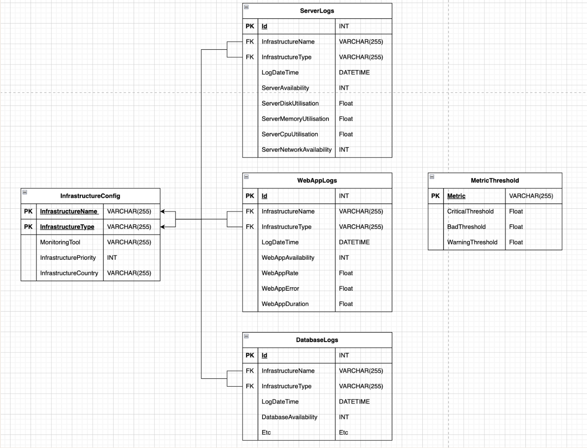
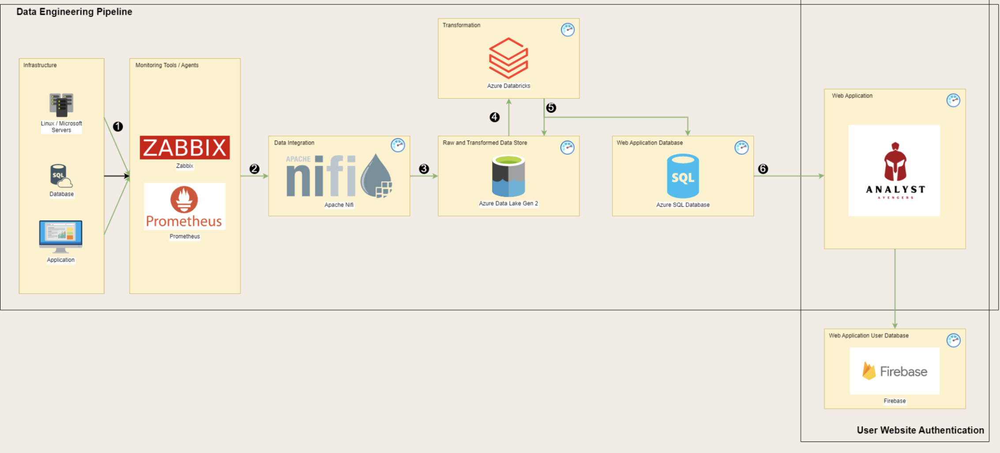

# AnalystAvengers
Full-Stack Data Engineering Monitoring Tool

## Recommended IDE Setup

[VSCode](https://code.visualstudio.com/) + [Volar](https://marketplace.visualstudio.com/items?itemName=Vue.volar) (and disable Vetur) + [TypeScript Vue Plugin (Volar)](https://marketplace.visualstudio.com/items?itemName=Vue.vscode-typescript-vue-plugin).

## Customize configuration

See [Vite Configuration Reference](https://vitejs.dev/config/).

<!-- Frontend -->
## Project Setup

```sh
npm i all
```

### Compile and Hot-Reload for Development

```sh
npm run dev
```

### Compile and Minify for Production

```sh
npm run build
```

<!-- Backend -->
## install all the dependencies

```sh
pip install -r requirements.txt
```

## Initiate core functionality
```sh
python main.py
```

## Database Diagram


## Architecture Diagram

